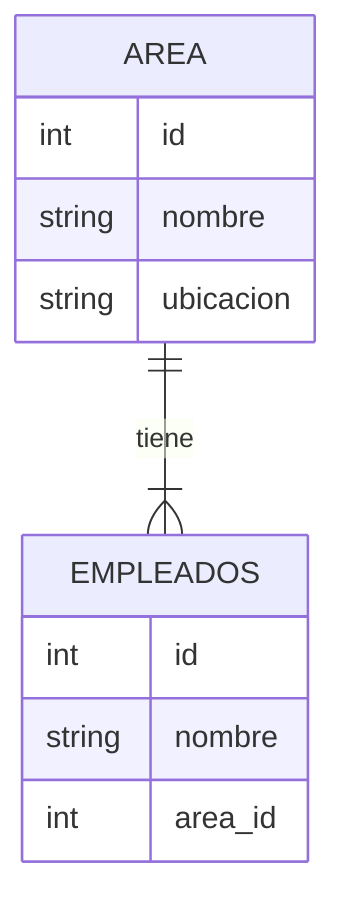

# Gestor de Empleados y Áreas 🏢

Este proyecto es una sencilla aplicación de consola para gestionar empleados y áreas en una organización.

## Estructura de la Base de Datos 📊

La base de datos está compuesta por dos tablas: `areas` y `empleados`. La tabla `areas` almacena información sobre las distintas áreas de la organización, mientras que la tabla `empleados` almacena información sobre los empleados.



## Funcionalidades de la Aplicación 💼

La aplicación ofrece las siguientes funcionalidades a través de un menú interactivo:

1. **Cargar datos en 'areas'**: Permite al usuario ingresar un nuevo área en la base de datos.
2. **Cargar datos en 'empleados'**: Permite al usuario ingresar un nuevo empleado en la base de datos.
3. **Listar 'areas'**: Muestra una lista de todas las áreas en la base de datos.
4. **Listar 'empleados'**: Muestra una lista de todos los empleados en la base de datos, incluyendo el nombre del área a la que pertenecen.
5. **Actualizar 'area'**: Permite al usuario actualizar la información de un área existente en la base de datos.
6. **Actualizar 'empleado'**: Permite al usuario actualizar la información de un empleado existente en la base de datos.

## Estructura del Código 📚

El código se divide en tres archivos principales, y tres extras:

- `main.py`: Contiene la lógica principal del programa, incluyendo el menú interactivo.
- `coneccion_BD.py`: Establece la conexión con la base de datos.
- `operaciones_BD.py`: Define las funciones para interactuar con la base de datos, como insertar y actualizar datos.

 Extra 1 `crear_tablas.py`: script que se llama una sola vez, para crear las tablas.
 Extra 2 `requeriments.txt`: Dependencias del proyecto 
 Extra 3 `.env`: variables para la conexión a la BD. (Éste lo debes crear tu mismo, en el siguiente punto te  explicamos cómo hacerlo).

## Cómo Ejecutar la Aplicación 🚀

### 1 - Configuración de la Base de Datos 🗄️

Para configurar la conexión a la base de datos, este proyecto utiliza un archivo `.env`. Deberás crear tu propio archivo `.env` en el directorio raíz del proyecto y configurar las variables de entorno para tu base de datos.

Aquí te mostramos cómo hacerlo:

1. En el directorio raíz del proyecto, crea un nuevo archivo y nómbralo `.env`.
2. Abre el archivo `.env` y añade las siguientes líneas, reemplazando los valores de ejemplo con las credenciales de tu base de datos:

    ```env
    DB_NAME=nombre_de_tu_base_de_datos
    DB_USER=usuario_de_tu_base_de_datos
    DB_PASSWORD=contraseña_de_tu_base_de_datos
    DB_HOST=host_de_tu_base_de_datos
    DB_PORT=puerto_de_tu_base_de_datos
    ```

3. Guarda y cierra el archivo `.env`. La aplicación ahora debería ser capaz de acceder a tu base de datos utilizando las credenciales que proporcionaste.

###2 -  Instalación de las Dependencias 📦

Este proyecto requiere algunas bibliotecas externas de Python para funcionar correctamente. Puedes instalar estas bibliotecas utilizando `pip`, el gestor de paquetes de Python.

Para instalar las dependencias del proyecto, navega hasta el directorio raíz del proyecto en tu terminal y ejecuta el siguiente comando:

```bash
pip install -r requirements.txt
```
### 3 - Ejecutar la aplicación
Simplemente navega hasta el directorio del proyecto en tu terminal y ejecuta primero el script `crear_tablas.py` y luego `main.py`, con Python:

```bash
python main.py
```
