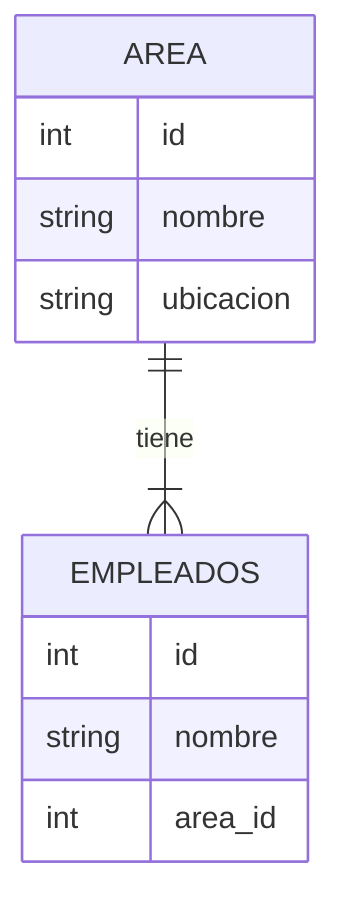

# Gestor de Empleados y Áreas 🏢

Este proyecto es una sencilla aplicación de consola para gestionar empleados y áreas en una organización.

## Estructura de la Base de Datos 📊

La base de datos está compuesta por dos tablas: `areas` y `empleados`. La tabla `areas` almacena información sobre las distintas áreas de la organización, mientras que la tabla `empleados` almacena información sobre los empleados.



## Funcionalidades de la Aplicación 💼

La aplicación ofrece las siguientes funcionalidades a través de un menú interactivo:

1. **Cargar datos en 'areas'**: Permite al usuario ingresar un nuevo área en la base de datos.
2. **Cargar datos en 'empleados'**: Permite al usuario ingresar un nuevo empleado en la base de datos.
3. **Listar 'areas'**: Muestra una lista de todas las áreas en la base de datos.
4. **Listar 'empleados'**: Muestra una lista de todos los empleados en la base de datos, incluyendo el nombre del área a la que pertenecen.
5. **Actualizar 'area'**: Permite al usuario actualizar la información de un área existente en la base de datos.
6. **Actualizar 'empleado'**: Permite al usuario actualizar la información de un empleado existente en la base de datos.

## Estructura del Código 📚

El código se divide en tres archivos principales, y uno extra:

- `main.py`: Contiene la lógica principal del programa, incluyendo el menú interactivo.
- `coneccion_BD.py`: Establece la conexión con la base de datos.
- `operaciones_BD.py`: Define las funciones para interactuar con la base de datos, como insertar y actualizar datos.

 Extra `crear_tablas.py`: script que se llama una sola vez, para crear las tablas.

## Cómo Ejecutar la Aplicación 🚀

Para ejecutar la aplicación, simplemente navega hasta el directorio del proyecto en tu terminal y ejecuta primero el script `crear_tablas.py` y luego `main.py`, con Python:

```bash
python main.py
```
